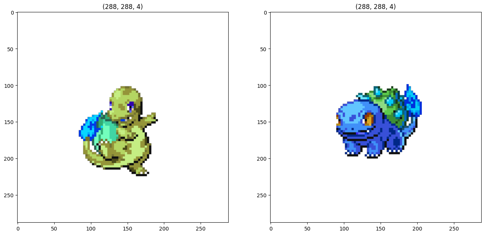

# VAE Battlers (POKEMON) Generation

## Dataset

The dataset was based on the PkmnInfiniteFusion custom battlers sprites. Which are handmade sprites rather than the generated sprites from  [PokeFusion](https://pokemon.alexonsager.net/) and then were voted by the community. 

### Dataset Specs

the number of handmade Battlers sprites can be increased overtime, but for now the dataset has more than 50K png sprites of 288x288 RGBA images (None,288,288,4). 

## Model

The model is based on VAE (Variational Auto Encoder) with cyclical k1 loss anneling.

### VAE

It's VAE and it's 2023 go learn.

### Loss

the loss are splittet into major parts:
1. Reconstruction loss (RGB loss + Mask loss)
   1. RGB loss
   2. Mask loss/Alpha loss (im surprised that I am not the only one who uses this loss)
2. K1 loss with cyclical anneling

### Cyclical k1 loss anneling
This is a trick for mitigating K1 loss vanishes by cyclical anneling the k1 loss every n minibatches. (should be epoch but I am training on macbook air M1 and by the time I finishes 1 cycle I would created a fresh MHW:IB file and beat Fatalis by then :D (RECORD TIME 100 ish hours))

[Blogpost](https://medium.com/mlearning-ai/a-must-have-training-trick-for-vae-variational-autoencoder-d28ff53b0023)

[Paper](https://aclanthology.org/N19-1021.pdf)

# TODO
- [ ] Add tensorboard
- [ ] Add MLflow
- [ ] Explore wandb 